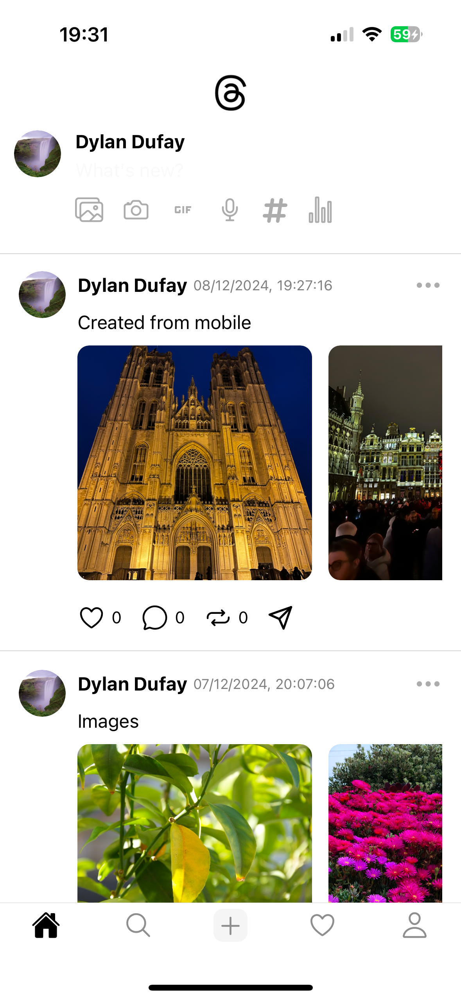

# This is a Thread app clone

## Tools

```
- Expo
- Convex (CMS)
- Clerk (Authentification)
```

## How to install

```
- Create clerk account and add EXPO_PUBLIC_CLERK_PUBLISHABLE_KEY to your .env file
- Create a convex account and add CONVEX_DEPLOYMENT
EXPO_PUBLIC_CONVEX_URL to your .env file
- npm i
- npx expo run:ios or npx expo run:android
```

## List of threads



## Profile page


